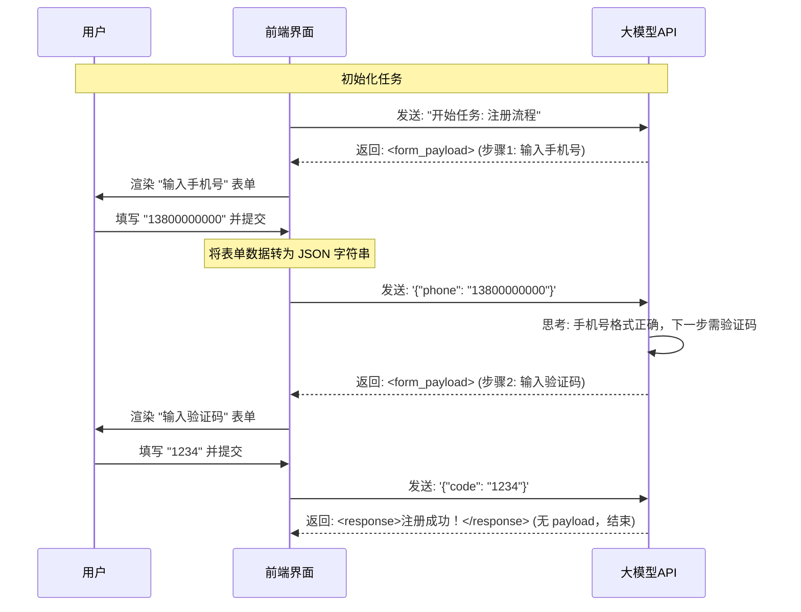

# Form Agent 交互模式通用解决方案

本文档详细描述了如何在任何 AI 应用中复现 "Form Agent"（表单驱动的智能体）交互模式。这种模式的核心在于**让 AI 不仅输出对话文本，而是输出结构化的表单定义**，从而在对话流中嵌入精准的用户输入界面。

## 1. 核心设计理念

传统的 Chatbot 是一问一答的文本流。Form Agent 则是 **"状态机 + 动态UI"**：
1.  **AI 是导航员**：它分析当前的任务进度（状态）。
2.  **表单是方向盘**：AI 决定下一步用户需要填写什么数据，并动态生成界面。
3.  **用户是驾驶员**：用户填写表单，提交数据。
4.  **循环**：数据提交回 AI，AI 再次分析，生成下一个表单。

---

## 2. 关键协议设计 (Protocol)

为了实现"每次对话都显示表单"，必须强制 AI 遵循严格的输出协议。我们推荐使用 **XML + JSON** 的混合格式，因为这种格式对大模型（特别是 Claude 和 Gemini）非常友好且鲁棒。

### AI 的输出格式规范

要求 AI 必须严格按照以下 XML 标签包裹内容：

```xml
<!-- 1. 思考过程 (可选但推荐，用于调试和展示AI意图) -->
<active_inference_audit>
分析用户当前的输入，判断任务执行到了哪一步。
例如：用户已经提交了名称，下一步需要详细描述。
</active_inference_audit>

<!-- 2. 表单定义 (核心载体) -->
<form_payload>
{
  "title": "当前步骤的标题 (例如：完善个人信息)",
  "description": "给用户的操作指引",
  "fields": [
    {
      "key": "user_age",          // 字段唯一标识
      "label": "您的年龄",         // 显示标签
      "type": "number",           // 渲染类型: text, textarea, select, number
      "required": true,
      "placeholder": "请输入数字"
    },
    {
      "key": "interest",
      "label": "感兴趣的领域",
      "type": "select",
      "options": ["编程", "设计", "产品"]
    }
  ]
}
</form_payload>

<!-- 3. 对话摘要 (用于历史记录回溯) -->
<response>
好的，我已经收到了您的基础信息，请继续完善详细资料。
</response>
```

---

## 3. 实现步骤 (前端/后端)

要在你的应用中复现这个效果，请遵循以下四个步骤。

### 步骤一：Prompt Engineering (系统提示词)

这是最关键的一步。你需要在系统提示词 (System Prompt) 中不仅定义角色，还要**强行植入**上述协议。

**推荐的 System Prompt 模板：**

```text
# ROLE
你是一个 Form-Driven Agent（表单驱动智能体）。
你的目标是通过一系列步骤引导用户完成复杂任务。

# PROTOCOL (绝对规则)
1. 你禁止仅输出纯文本。每一个交互回合，你必须生成一个下一步操作的表单。
2. 你必须严格遵循 XML 输出格式。

# INTERFACE DEFINITION (表单能力)
你可以使用的控件类型 (type)：
- text: 短文本输入
- textarea: 长文本描述
- select: 下拉选择 (必须提供 options 数组)
- number: 数字输入

# OUTPUT FORMAT
请始终按此格式回复：
<active_inference_audit>你的思考过程</active_inference_audit>
<form_payload>
{ "title": "...", "fields": [...] } (必须是合法的 JSON)
</form_payload>
<response>简短的文本总结</response>
```

### 步骤二：前端解析与渲染 (Parser & Renderer)

在前端收到 AI 的流式或完整响应后，需要进行解析。

1.  **正则提取**：使用正则表达式提取 `<form_payload>...</form_payload>` 之间的内容。
    *   Regex: `/<form_payload>([\s\S]*?)<\/form_payload>/`
2.  **JSON Parse**：将提取的字符串解析为 JSON 对象。
3.  **动态组件渲染**：
    *   创建一个通用组件 `DynamicForm`。
    *   遍历 JSON 中的 `fields` 数组。
    *   根据 `field.type` 渲染对应的 HTML 标签 (`<input>`, `<textarea>`, `<select>`)。

### 步骤三：数据回传机制 (Submission Loop)

当用户在 UI 上填写表单并点击“提交”时，**不要**像普通聊天那样发送 "我填好了" 这种自然语言。
**必须**将结构化的数据序列化为文本，作为用户的 Prompt 发送给 AI。

**推荐的用户消息格式（发送给 AI 的）：**
```text
[SYSTEM_ANNOTATION: Form Submission Data]
{
  "user_age": "25",
  "interest": "编程"
}
```

这样 AI 就能在下一轮对话中准确读取这些变量，而不是去猜测自然语言。

### 步骤四：上下文维护 (Context Management)

为了让 AI 记得住之前的步骤，建议在每一轮 Prompt 中附带上任务的背景信息（Context）。

**构建 Prompt 的伪代码：**

```javascript
const finalPrompt = `
[任务目标]
${task_description}

[已收集的信息]
${JSON.stringify(current_state_variables)}

[用户最新提交]
${user_form_submission_json}

请根据以上信息，生成下一步的表单。
`;
```

---

## 4. 完整交互时序图



## 5. 常见问题排查

1.  **AI 有时输出 JSON 有时输出文本？**
    *   **解决**：在 System Prompt 中加重语气，使用 "Always", "Must", "Strictly" 等词汇。并且在 Few-Shot (少样本) 示例中展示正确的格式。
2.  **JSON 解析失败？**
    *   **解决**：大模型偶尔会在 JSON 中包含 Markdown 代码块标记（\`\`\`json）。编写解析器时，先用正则 `clean` 掉这些标记再 `JSON.parse`。
3.  **表单字段逻辑太复杂？**
    *   **解决**：不要试图一次性生成过于复杂的级联表单。利用多轮对话的优势，将复杂表单拆解为类似于 Typeform 的 "One thing at a time" 多个简单步骤。

---

通过以上方案，你就可以在任何支持对话的系统中复现出类似 "Form Agent" 的高级交互体验。
